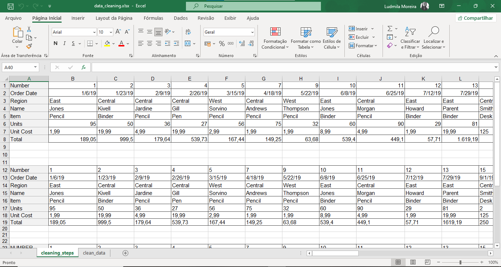

## Projeto de Limpeza e Transformação de Dados no Excel

### 🚀 Descrição
Este projeto foi desenvolvido com o objetivo de praticar técnicas de limpeza, organização e transformação de dados utilizando o Microsoft Excel.

Durante a atividade, foram aplicados processos fundamentais de preparação de dados para análise, incluindo remoção de valores vazios, padronização de textos, tratamento de espaços em branco e transposição de dados.

✨ ───────────── ✨

### 🎥 Demonstração
Processo de limpeza e transformação dos dados realizado no Excel.



### Fluxo
1. Identificação de células vazias 🔍  
2. Aplicação de filtros 🧹  
3. Remoção de linhas incompletas ❌  
4. Transposição dos dados 🔄  
5. Padronização de textos 🔠  
6. Limpeza de formatação 📊

✨ ───────────── ✨

### Tecnologias
- Microsoft Excel
- Fórmulas do Excel
- Filtros e formatação de dados

✨ ───────────── ✨

### Técnicas utilizadas
- Filtragem de dados
- Remoção de linhas vazias
- Transposição de tabelas
- Uso das fórmulas ARRUMAR e MAIÚSCULA
- Conversão de formatos
- Limpeza de espaços em branco
- Padronização de dados
- Limpeza de formatação

✨ ───────────── ✨

### Como executar

1. Abra o arquivo `.xlsx` no Microsoft Excel  
2. Utilize os filtros para localizar células vazias  
3. Remova linhas incompletas  
4. Utilize a opção “Transpor” para reorganizar os dados  
5. Aplique fórmulas de limpeza e padronização  
6. Salve a versão final da planilha limpa

✨ ───────────── ✨

### Estrutura do projeto
```bash
excel-data-cleaning-project/
│
├── raw_data.xlsx
├── cleaned_data.xlsx
├── demo.png
├── README.md
└── .gitignore
```

✨ ───────────── ✨

### Observações
- Este projeto foi desenvolvido como prática de limpeza e preparação de dados  
- O processo foi realizado inteiramente no Microsoft Excel  
- Foram utilizadas funções nativas para tratamento e padronização de dados  
- A atividade envolveu transformação de dados em formato longo para formato amplo  
- O exercício reforça conceitos importantes de Data Cleaning para análise de dados

✨ ───────────── ✨

### Possíveis melhorias
- Automatização do processo com Python  
- Criação de dashboards no Power BI  
- Integração com bancos de dados  
- Aplicação de validação de dados  
- Automação com VBA  
- Criação de pipeline ETL simples

✨ ───────────── ✨

### Sobre mim

Ludmila Alves Moreira

💻 Estudante de Tecnologia

🔗 Linkedin: linkedin.com/in/ludmilasevla

🔗 Github: github.com/ludmilasevla

Este projeto faz parte da minha jornada de aprendizado na área de tecnologia e análise de dados.
Durante o desenvolvimento, pratiquei conceitos essenciais de Data Cleaning e manipulação de planilhas, fortalecendo habilidades importantes para preparação de dados e processos analíticos.
Busco continuamente aprimorar meus conhecimentos em análise de dados, automação e desenvolvimento de soluções práticas utilizando tecnologia.
